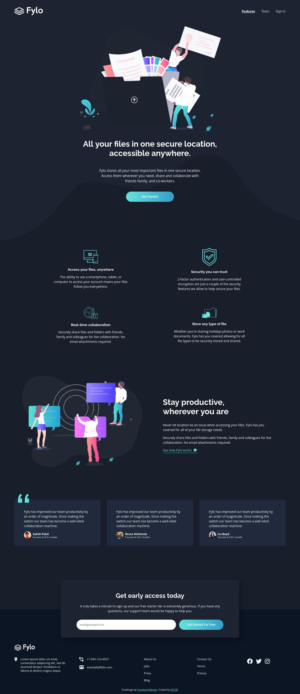

# Frontend Mentor - Fylo dark theme landing page solution

This is a solution to the [Fylo dark theme landing page challenge on Frontend Mentor](https://www.frontendmentor.io/challenges/fylo-dark-theme-landing-page-5ca5f2d21e82137ec91a50fd). Frontend Mentor challenges help you improve your coding skills by building realistic projects. 

### The challenge

Users should be able to:

- View the optimal layout for the site depending on their device's screen size
- See hover states for all interactive elements on the page

### Screenshot - solution

### Links

- Solution URL: [frontendmentor.io/solutions/fylodarkthemelandingpagemaster-OTw3LJsSs](https://www.frontendmentor.io/solutions/fylodarkthemelandingpagemaster-OTw3LJsSs)
- Live Site URL: [somi00138.github.io/fylo-dark-theme-landing-page-master/](https://somi00138.github.io/fylo-dark-theme-landing-page-master/)

